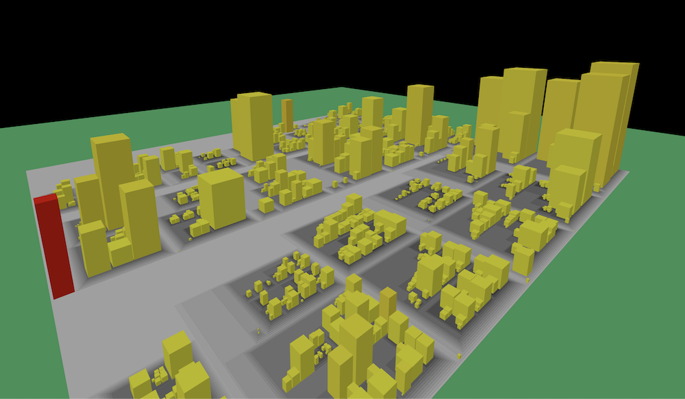

# City Blocks

City Blocks is a 3D visualization of code churn and size in a Git repo.

## Legend
- Grey foundations are parent directories. It darkens progressively as it stacks up.
- Area of the building or block is relative to the lines of code
- Height is relative to the number of commits made to that file
- Color of the building i.e heat is based on churn % compared to the file with highest churn (blue > yellow > red)

## How to use (only tested in Mac)

1. run `npm install`
2. run `node index.js`
3. browse `http://localhost:3000`
4. see the demo
5. in order to visualize a different repo, go to project-root directory
6. run `git_repo_stats.sh <<git-clone-url>>`. This updates the data.csv for new repo
7. now refresh browser
8. refine output by excluding unncessary files in `.stat_exclude` file. follow glob pattern